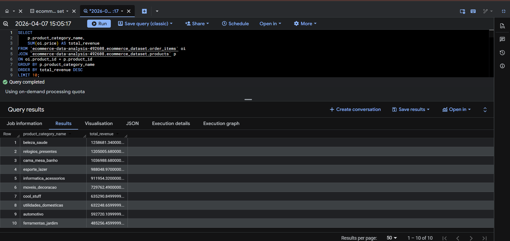
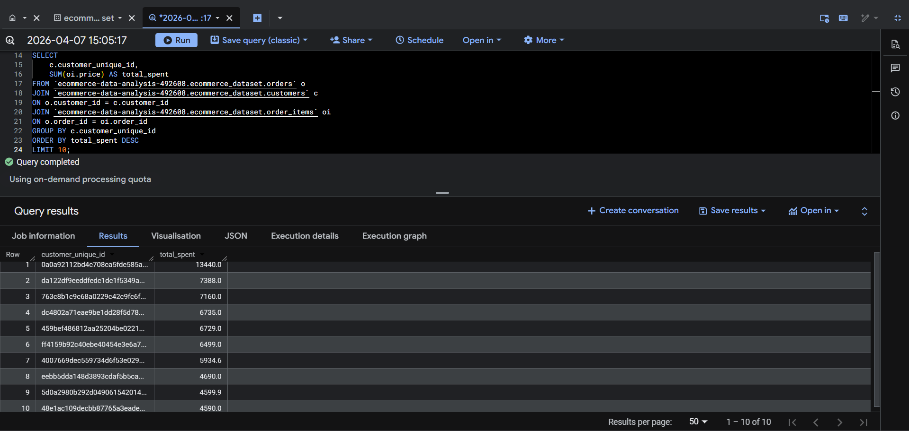
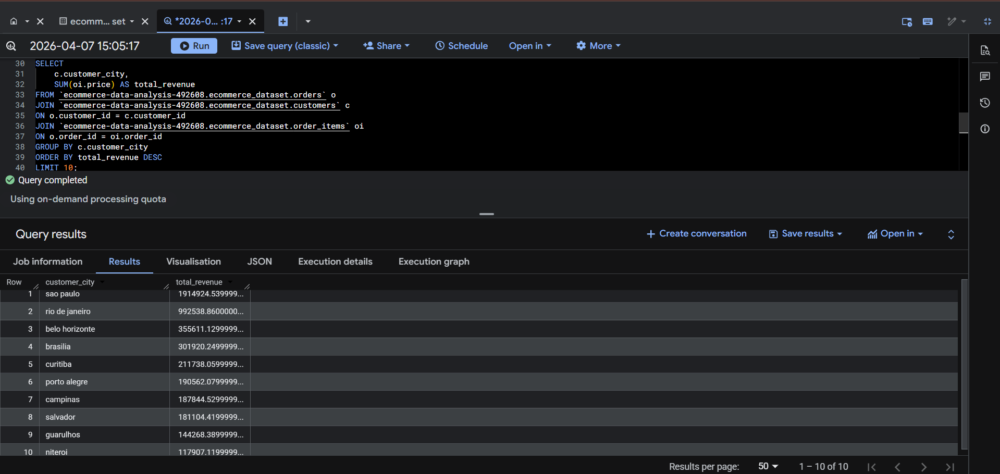
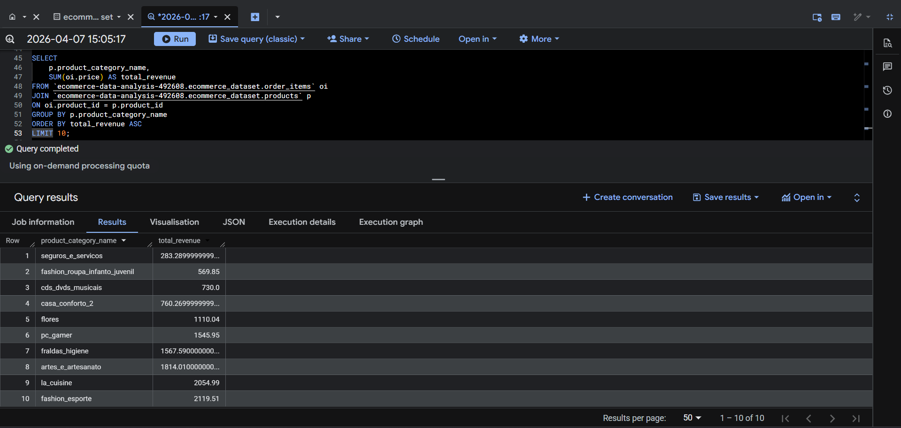

# E-commerce Sales & Customer Intelligence using BigQuery

## 📌 Project Overview
This project analyzes a real-world e-commerce dataset (~100K+ transactions) to generate business insights using SQL and Google BigQuery.

## 🎯 Problem Statement
To analyze sales and customer behavior to support business decisions such as:
- Identifying top-performing products
- Understanding customer spending patterns
- Analyzing regional demand
- Detecting underperforming products

## 🛠 Tools & Technologies
- SQL
- Google BigQuery
- Kaggle Dataset (Olist E-commerce)

## 📊 Key Insights

### 1. Top Revenue Categories
- Beauty & Health products generated the highest revenue
- Indicates strong demand in specific categories

### 2. High-Value Customers
- A small group of customers contributes a large portion of total revenue
- Useful for targeted marketing strategies

### 3. City-wise Revenue
- São Paulo is the highest revenue-generating city
- Shows demand concentration in major urban areas

### 4. Underperforming Categories
- Some categories generate minimal revenue
- Can be optimized through discounting or inventory reduction

## 📷 Screenshots

### Top Categories

### Top Customers

### City-wise Revenue

### Low Performing Categories

## 📁 Dataset
Olist Brazilian E-commerce Dataset (Kaggle)

## 🚀 Outcome
This project demonstrates the use of SQL and BigQuery to solve real-world business problems and generate actionable insights.
